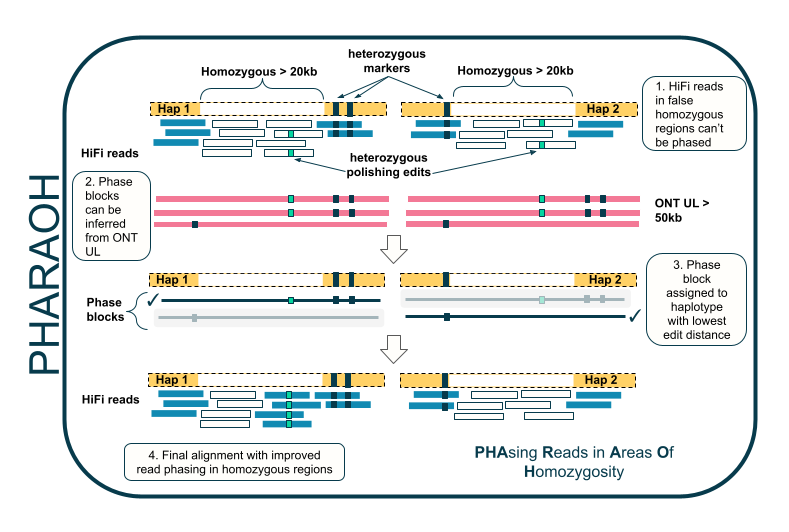
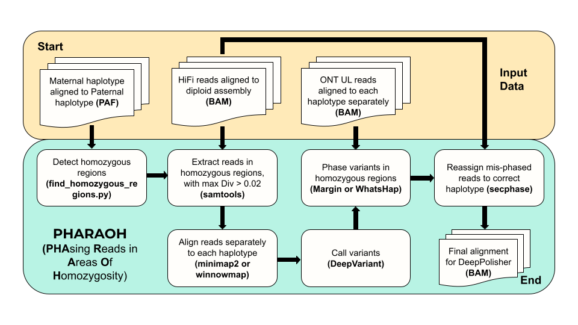

# PHARAOH - **PHA**sing **R**eads in **A**reas **O**f **H**omozygosity

### Overview

PHARAOH is a pipeline used for correcting the phasing of HiFi reads aligned to a diploid assembly. PHARAOH uses ONT UL reads to phase HiFi reads in regions where the diploid assembly is falsely homozygous for stretches longer than the length of the HiFi reads. For the rest of the genome, PHARAOH uses secondary alignments to re-assign reads to the correct haplotype, as implemented in [secphase](https://github.com/mobinasri/secphase). PHARAOH was developed to provide highly accurate read phasing to the [DeepPolisher model](https://github.com/google/deeppolisher) for polishing the HPRC samples.

### Steps:
  1.  Align haplotype 1 assembly to haplotype 2 assembly, and [detect homozygous regions](https://github.com/mobinasri/secphase?tab=readme-ov-file#detecting-homozygous-regions).
  2. Align HiFi reads to the diploid assembly using minimap2 or winnowmap. Extract the reads in the homozygous regions identified by step 1, filtering out reads with too high a divergence from the assembly (de > 0.02).
  3. Align homozygous reads to each haplotype using minimap2 or winnowmap
  4. Call variants with [deepvariant](https://github.com/google/deepvariant), extracting just homozygous calls  
  5. Align ONT UL reads > 100kb to each haplotype separately. Using these reads, apply Margin or WhatsHap to phase the homozygous variants called by DeepVariant in Step 4.
  6. Run secphase in dual mode [as described here](https://github.com/mobinasri/secphase?tab=readme-ov-file#running-secphase-in-dual-mode). Secphase will use phased variants from step 5 to assign reads in homozygous regions to the correct haplotype. In non-homozygous regions, marker-mode of secphase will be applied.
  7. Final alignment is produced, with read phasing fixed in homozygous regions.

### Running PHARAOH

PHARAOH is implemented as a wdl workflow. 
